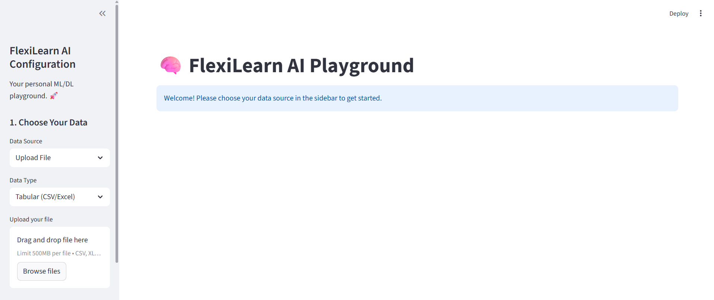
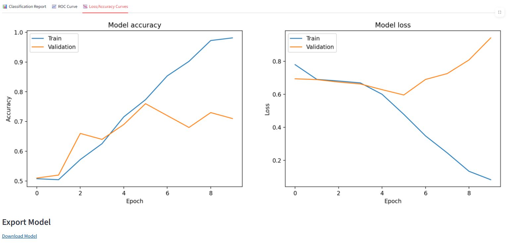

# 🧠 FlexiLearn AI Playground

**A No-Code Machine Learning & Deep Learning Platform** 

FlexiLearn AI is an interactive Streamlit application that empowers users to train, evaluate, and compare both classical machine learning and deep learning models—all through an intuitive web interface. Whether you're working with tabular data or images, FlexiLearn AI provides guided workflows, flexible architecture builders, and comprehensive visualizations to make AI accessible to everyone.


*The FlexiLearn AI interface: your personal ML/DL laboratory*

---

## 🌟 Key Features

- **Dual Data Support**: Work with tabular data (CSV/Excel) or image datasets (ZIP archives)
- **Two Problem Types**: Classification and Regression for tabular data
- **Two Model Families**:
  - **Classical ML** (Scikit-learn): Logistic Regression, Random Forest, SVM, KNN, Decision Trees
  - **Deep Learning** (PyTorch): Custom ANNs for tabular data, CNNs for images
- **Automated Preprocessing**: One-click data preparation with smart defaults
- **Interactive Architecture Builder**: Design neural networks layer-by-layer with real-time feedback
- **Rich Visualizations**: Confusion matrices, ROC curves, training histories, and more
- **Model Comparison**: Track and compare multiple training runs side-by-side
- **Export Trained Models**: Download models (.pkl for Scikit-learn, .pth for PyTorch)
- **Modular Architecture**: Clean, organized codebase split into logical components

---

## 🚀 Getting Started

### Prerequisites

- Python 3.8 or higher
- pip package manager

### Installation

1. **Clone or download this repository**

2. **Navigate to the project directory**:
   ```bash
   cd Streamlit_app_deep
   ```

3. **Create a virtual environment** (recommended):
   ```bash
   # Windows
   python -m venv .venv
   .venv\Scripts\activate

   # macOS/Linux
   python3 -m venv .venv
   source .venv/bin/activate
   ```

4. **Install dependencies**:
   ```bash
   pip install -r requirements.txt
   ```

5. **Launch the application**:
   ```bash
   # From the Streamlit_app_deep directory
   python -m streamlit run src/app.py
   ```

6. **Open your browser** to the URL shown in the terminal (typically `http://localhost:8501`)

### Project Structure

```
Streamlit_app_deep/
├── .streamlit/
│   └── config.toml              # Streamlit configuration (500MB upload limit)
├── src/
│   ├── app.py                   # Main application (47 lines - orchestration only)
│   ├── ui/                      # User interface components
│   │   ├── sidebar.py           # Sidebar configuration and data selection
│   │   ├── data_preview.py      # Data preview and preprocessing
│   │   ├── model_configuration.py  # Model building and training
│   │   └── results_display.py   # Results visualization and export
│   ├── models/
│   │   └── custom_datasets.py   # Custom PyTorch datasets (ImageZipDataset)
│   ├── evaluation/
│   │   └── visualization.py     # Plotting functions (confusion matrix, ROC, etc.)
│   └── utils/
│       ├── session_state.py     # Session state initialization
│       ├── export_utils.py      # Model export utilities
│       └── data_loaders.py      # Data loading helpers
├── requirements.txt
└── README.md
```


---

## 📚 Complete User Guide

### Step 1: Data Selection & Upload


*Choose your data source: upload your own files or use classic datasets*

The sidebar is your command center. Start by selecting your data source:

#### Option A: Upload Your Own Data

**For Tabular Data (Classification or Regression)**:
- Supported formats: `.csv`, `.xlsx`, `.txt`
- Your data should have features in columns and one target column
- Example: A CSV with customer data and a "purchased" column for classification, or house features with a "price" column for regression
- **Max file size**: 500MB

**For Image Data (Classification)**:
- Supported format: `.zip` files
- Structure your ZIP with folders for each class:
  ```
  dataset.zip
  ├── cats/
  │   ├── cat001.jpg
  │   ├── cat002.jpg
  ├── dogs/
  │   ├── dog001.jpg
  │   ├── dog002.jpg
  ```
- **Max file size**: 500MB

#### Option B: Use Classic Datasets

Perfect for learning and experimentation:
- **Iris Dataset**: 150 samples of iris flowers, 4 features, 3 classes (Classification)
- **California Housing**: 20,640 samples with 8 features predicting median house prices (Regression)


*Loading the Iris dataset for quick experimentation*

---

### Step 2: Data Preprocessing

#### For Tabular Data


*Configure preprocessing: select your target column and process the data*

1. **Preview Your Data**: The app displays the first few rows and the shape of your dataset
2. **Select Target Column**: Choose which column you want to predict
3. **Click "🚀 Quick Process Data"**: This automates:
   - Missing value imputation (median for numbers, most frequent for categories)
   - Feature scaling (standardization for numerical features)
   - One-hot encoding for categorical features
   - Train-test split (80/20 by default)
   - Label encoding for classification targets


*After processing: data is ready for model training*

#### For Image Data


*Configure image preprocessing: select root folder, resize dimensions, and train-test split*

1. **Select Root Folder**: Choose the folder containing your class subdirectories
2. **Resize Images**: Use the slider to set the target size (e.g., 64x64 pixels)
   - Smaller = faster training, less detail
   - Larger = slower training, more detail
3. **Train-Test Split**: Choose the percentage of data to reserve for testing
4. **Click "🖼️ Process Images"**: The app will:
   - Resize all images
   - Normalize pixel values
   - Create train/test splits
   - Display sample images from your dataset


---

### Step 3: Model Configuration & Training

Once your data is processed, it's time to build and train your model.

#### Classical Machine Learning (Scikit-learn)


*Select and configure a classical ML model*

**For Classification**:
- **Logistic Regression**: Simple, fast, great baseline
  - Tune: Regularization strength (C)
- **Random Forest Classifier**: Powerful ensemble method
  - Tune: Number of trees, max depth
- **Support Vector Machine (SVM)**: Excellent for complex boundaries
  - Tune: Regularization (C), kernel type (linear, RBF, polynomial)
- **K-Nearest Neighbors**: Instance-based learning
  - Tune: Number of neighbors (K)
- **Decision Tree Classifier**: Interpretable, visual decision rules
  - Tune: Max depth

**For Regression**:
- **Linear Regression**: Simple linear relationships
- **Random Forest Regressor**: Handles non-linear patterns
  - Tune: Number of trees, max depth
- **Support Vector Regressor (SVR)**: Robust to outliers
  - Tune: Regularization (C), kernel type

After configuring, click **"💪 Train [Model Name]"** to start training. Results appear instantly!

---

#### Deep Learning (PyTorch)

Deep learning is where FlexiLearn AI truly shines. You get complete control over neural network architecture with guided workflows that help you design powerful models.

##### Understanding Problem Types

Before building your network, it's crucial to understand what type of problem you're solving:

**Classification**: Predicting categories or labels
- **Binary Classification**: Two classes (e.g., spam/not spam, cat/dog)
- **Multi-class Classification**: Multiple classes (e.g., digit recognition 0-9, animal species)
- **Output**: Probability distribution over classes (e.g., 70% cat, 30% dog)
- **Loss Function**: CrossEntropyLoss (combines Softmax + NLL)
- **Final Activation**: Softmax (applied internally by PyTorch's CrossEntropyLoss)

**Regression**: Predicting continuous numerical values
- **Examples**: House prices, temperature, stock prices, age
- **Output**: A single number or vector of numbers
- **Loss Function**: Mean Squared Error (MSE) or Mean Absolute Error (MAE)
- **Final Activation**: None (linear output)

**Key Difference**: Classification outputs probabilities that sum to 1, regression outputs raw numerical predictions.

---

##### Architecture Mode: Suggested vs. Custom

FlexiLearn AI offers two ways to design your neural network:

**Suggested Mode** (Recommended for beginners):
- Pre-configured, proven architectures
- Optimized for common use cases
- Just pick a template and train
- Great starting point to understand what works

**Custom Mode** (For advanced users and experimentation):
- Build networks layer-by-layer from scratch
- Full control over every neuron, activation, and connection
- Perfect for research, learning, and pushing boundaries
- Requires understanding of network architecture principles


*The Architecture Guide: context-aware tips and layer-building suggestions for both ANNs and CNNs*

The **Architecture Guide** is your AI assistant. It provides:
- Real-time suggestions based on your data type and problem
- Best practices for layer design
- Common pitfalls to avoid
- Recommended starting architectures

---

##### For Tabular Data: Artificial Neural Networks (ANNs)

Artificial Neural Networks are the foundation of deep learning. They learn patterns by connecting layers of artificial neurons, each transforming the data in useful ways.

**Understanding ANN Components**:

1. **Dense (Linear) Layer**: The core building block
   - Fully connects every input to every output neuron
   - Each connection has a "weight" that the network learns
   - **Neurons**: How many outputs this layer produces
   - **Rule of thumb**: Start wide (128-256), gradually narrow (64→32→16)

2. **Activation Functions**: The "decision makers"
   - Without activation, networks can only learn linear patterns (boring!)
   - Activations introduce non-linearity, allowing complex pattern learning
   
   - **ReLU** (Rectified Linear Unit) - **Most Popular**:
     - Fast to compute
     - Prevents vanishing gradients
     - Formula: `max(0, x)` (negative values become 0)
     - Use for: Almost everything
   
   - **LeakyReLU**:
     - Like ReLU but allows small negative values
     - Prevents "dead neurons" problem
     - Use for: When ReLU neurons "die" during training
   
   - **Tanh** (Hyperbolic Tangent):
     - Outputs between -1 and 1
     - Centered around 0 (good for normalized data)
     - Use for: When you need outputs in a specific range
   
   - **Sigmoid**:
     - Outputs between 0 and 1
     - Use for: Binary classification in output layer (though CrossEntropyLoss handles this)

3. **Dropout**: The "forgetfulness" technique
   - Randomly ignores some neurons during training
   - Forces the network to learn robust features
   - **Dropout Rate**: Percentage of neurons to drop (0.2 = 20%, 0.5 = 50%)
   - **When to use**:
     - 0.0: No dropout (risk of overfitting on small datasets)
     - 0.2-0.3: Light regularization
     - 0.5: Heavy regularization (large networks, lots of data)
   - **Pro tip**: Never use dropout in the output layer!

**Architecture Patterns**:

**For Classification**:
```
Input (n_features) 
  → Dense(128) → ReLU → Dropout(0.3)
  → Dense(64) → ReLU → Dropout(0.3)
  → Dense(32) → ReLU
  → Output(n_classes) → Softmax (handled by CrossEntropyLoss)
```

**For Regression**:
```
Input (n_features)
  → Dense(64) → ReLU → Dropout(0.2)
  → Dense(32) → ReLU
  → Output(1) [Linear - no activation!]
```

**Why the difference?**
- Classification needs probability outputs (Softmax handles this)
- Regression needs raw numerical values (no activation = linear output)

---

**Building Custom ANNs**:


*The custom ANN layer builder: add dense layers with configurable neurons, activations, and dropout*

1. **Add Layers**: Click "Add Layer" to create a new hidden layer
2. **Configure Each Layer**:
   - **Neurons**: Start with powers of 2 (32, 64, 128, 256)
   - **Activation**: ReLU for 99% of cases
   - **Dropout**: 0.0-0.5 depending on overfitting risk

3. **Layer Ordering Strategy**:
   - **Funnel Pattern** (recommended for classification):
     - Start wide: 128 or 256 neurons
     - Gradually narrow: 128 → 64 → 32
     - Forces the network to compress information
   
   - **Hourglass Pattern** (advanced):
     - Wide → Narrow → Wide
     - Creates a bottleneck that learns compressed representations
   
   - **Uniform Pattern** (for regression):
     - Same size throughout: 64 → 64 → 64
     - Simpler, less prone to vanishing gradients

4. **How Many Layers?**
   - **Small dataset (<1000 samples)**: 2-3 layers
   - **Medium dataset (1000-10000)**: 3-5 layers
   - **Large dataset (>10000)**: 5+ layers
   - **Remember**: More layers ≠ better. Start simple!

5. **Output Layer** (automatic):
   - For classification: Number of neurons = number of classes
   - For regression: 1 neuron
   - The app configures this based on your problem type

**Example Configurations**:

*Simple Binary Classification (e.g., spam detection)*:
```
Dense(32, ReLU, Dropout=0.2)
Dense(16, ReLU)
Output(2)
```

*Medium Multi-class Classification (e.g., Iris dataset)*:
```
Dense(64, ReLU, Dropout=0.3)
Dense(32, ReLU, Dropout=0.3)
Dense(16, ReLU)
Output(3)
```

*Regression (e.g., house price prediction)*:
```
Dense(128, ReLU, Dropout=0.2)
Dense(64, ReLU, Dropout=0.2)
Dense(32, ReLU)
Output(1)
```

---

##### For Image Data: Convolutional Neural Networks (CNNs)

CNNs are the gold standard for image recognition. Unlike ANNs that treat images as flat lists of pixels, CNNs understand spatial relationships—they "see" edges, textures, and shapes.

**Why CNNs for Images?**
- **Spatial Awareness**: Nearby pixels are related (e.g., edges, corners)
- **Translation Invariance**: Detects features regardless of position
- **Parameter Efficiency**: Millions fewer parameters than equivalent ANNs
- **Hierarchical Learning**: Low-level features (edges) → high-level concepts (faces, objects)

**Understanding CNN Layers**:

1. **Conv2d (Convolutional Layer)**: The "Pattern Scanner"
   - Slides small filters across the image
   - Each filter learns to detect a specific pattern (edge, texture, shape)
   
   - **Filters (out_channels)**: Number of different patterns to learn
     - Early layers: 16-32 filters (simple patterns like edges)
     - Middle layers: 32-64 filters (textures, parts)
     - Deep layers: 64-128+ filters (complex objects)
   
   - **Kernel Size**: Size of the scanning window
     - **3x3**: Most common, captures local patterns
     - **5x5**: Larger receptive field, slower
     - **1x1**: Adjusts number of channels without spatial scanning
   
   - **Padding**: Adds borders to preserve image size
     - `padding=1` with `kernel=3x3` keeps size the same
   
   - **Stride**: How many pixels to skip
     - `stride=1`: Scan every pixel (default)
     - `stride=2`: Skip every other pixel (downsamples)

2. **MaxPool2d (Pooling Layer)**: The "Downsampler"
   - Shrinks the image while keeping the most important information
   - Makes the network faster and more robust to small shifts
   
   - **Pool Size**: Usually 2x2 (halves each dimension)
   - **Effect**: 64x64 → Pool → 32x32, 32x32 → Pool → 16x16
   - **Why it works**: Takes the "strongest" signal in each region
   - **Alternative**: AvgPool2d (takes average instead of max)

3. **Flatten**: The "Bridge" between Conv and Dense layers
   - Converts 2D feature maps to 1D vector
   - Required before Dense layers
   - Example: 16x4x4 feature maps → 256-element vector

4. **Dense Layers**: The "Classifier"
   - After feature extraction, Dense layers combine features
   - Usually 1-2 Dense layers after flattening
   - Final Dense layer outputs class predictions

**Standard CNN Architecture Pattern**:

```
Input (3 channels x img_size x img_size)  [RGB image]
  ↓
Conv2d(16 filters, 3x3) → ReLU → MaxPool2d(2x2)  [Learn basic edges/colors]
  ↓
Conv2d(32 filters, 3x3) → ReLU → MaxPool2d(2x2)  [Learn textures/parts]
  ↓
Conv2d(64 filters, 3x3) → ReLU → MaxPool2d(2x2)  [Learn complex shapes]
  ↓
Flatten  [Convert to 1D]
  ↓
Dense(128) → ReLU → Dropout(0.5)  [Combine features]
  ↓
Output(n_classes) → Softmax  [Final classification]
```

**Key Principles**:
- **Increase filters as you go deeper**: 16 → 32 → 64 → 128
- **Alternate Conv and Pool**: Extract features, then downsample
- **Preserve spatial info early**: Don't pool too aggressively at the start
- **Add dropout before output**: Prevent overfitting on the classifier

---

**Building Custom CNNs**:


*The custom CNN layer builder: design convolutional and pooling layers with fine-grained control*

1. **Convolutional Layers**:
   - Click "Add Conv Layer"
   - **Filters**: Start with 16-32, double each layer (16→32→64)
   - **Kernel Size**: Use 3x3 for most cases
   - **Activation**: ReLU is standard

2. **Pooling Layers**:
   - Click "Add Pool Layer"
   - **Pool Size**: 2x2 is standard (reduces spatial size by half)
   - **Rule**: Pool after every 1-2 Conv layers

3. **Layer Ordering Strategy**:
   
   **Basic CNN** (2 Conv blocks):
   ```
   Conv(16, 3x3) → ReLU → MaxPool(2x2)
   Conv(32, 3x3) → ReLU → MaxPool(2x2)
   → Flatten → Dense(128) → ReLU → Output
   ```
   
   **Medium CNN** (3 Conv blocks):
   ```
   Conv(32, 3x3) → ReLU → MaxPool(2x2)
   Conv(64, 3x3) → ReLU → MaxPool(2x2)
   Conv(128, 3x3) → ReLU → MaxPool(2x2)
   → Flatten → Dense(256) → ReLU → Dropout(0.5) → Output
   ```
   
   **Deep CNN** (4+ Conv blocks):
   ```
   Conv(32, 3x3) → ReLU
   Conv(32, 3x3) → ReLU → MaxPool(2x2)
   Conv(64, 3x3) → ReLU
   Conv(64, 3x3) → ReLU → MaxPool(2x2)
   Conv(128, 3x3) → ReLU → MaxPool(2x2)
   → Flatten → Dense(512) → ReLU → Dropout(0.5) → Output
   ```

4. **How Deep to Go?**
   - **Small images (32x32)**: 2-3 Conv blocks
   - **Medium images (64x64)**: 3-4 Conv blocks
   - **Large images (128x128+)**: 4-6 Conv blocks
   - **Calculate receptive field**: Each 3x3 Conv sees further
   - **Avoid over-pooling**: Don't reduce to 1x1 too early

5. **Common Mistakes**:
   - ❌ Too many pools → Feature maps become too small
   - ❌ Same number of filters throughout → No hierarchical learning
   - ❌ No pooling → Network is huge and slow
   - ❌ Dense layers too large → Overfitting
   - ✅ Double filters, alternate Conv/Pool, add dropout

**Architecture Guide for CNNs**:

The guide provides real-time feedback:
- "Current receptive field: 7x7" (how much of the original image each neuron "sees")
- "Output size after this layer: 16x16x64"
- "Warning: Image too small for another pooling layer"
- "Suggestion: Add dropout before output to prevent overfitting"

---

##### Training Parameters (Critical for Deep Learning Success)


*Configure learning rate, epochs, and batch size before training*

Before clicking **"🧠 Train Deep Learning Model"**, configure these hyperparameters:

**1. Learning Rate**: The Most Important Hyperparameter
- **What it does**: Controls how much to adjust weights after each batch
- **Too high** (>0.01):
  - Weights jump around wildly
  - Loss is erratic or explodes
  - Model never converges
  - Signs: Loss increases or oscillates
  
- **Too low** (<0.0001):
  - Training is painfully slow
  - May get stuck in local minima
  - Wastes time and compute
  - Signs: Loss decreases very slowly
  
- **Sweet spot**: 0.001 (default for Adam optimizer)
  - Start here for almost all problems
  - Reduce by 10x if loss is unstable
  - Increase by 10x if training is too slow

- **Advanced**: Use learning rate schedulers
  - Start high, decay over time
  - Implemented in the app for long training runs

**2. Epochs**: How Long to Train
- **What it is**: One epoch = seeing the entire dataset once
- **More epochs**:
  - ✅ Model learns more patterns
  - ❌ Risk of overfitting (memorizing training data)
  - ❌ Takes more time
  
- **How many to use**:
  - **Small dataset (<1000 samples)**: 50-100 epochs
  - **Medium dataset (1000-10000)**: 20-50 epochs
  - **Large dataset (>10000)**: 10-30 epochs
  
- **Watch the curves**: 
  - Training & validation both improving → Keep going
  - Validation plateaus while training improves → STOP (overfitting!)
  - Both plateau → You've reached the limit

- **Early Stopping** (advanced):
  - Monitor validation loss
  - Stop if it doesn't improve for N epochs
  - Prevents wasted training time

**3. Batch Size**: Memory vs. Accuracy Trade-off
- **What it is**: Number of samples processed before updating weights
- **Smaller batches** (8, 16):
  - ✅ More frequent weight updates → faster learning
  - ✅ Better generalization (more noise in gradients)
  - ❌ Slower (more iterations)
  - ❌ Noisy loss curves
  - Use for: Small datasets, limited GPU memory
  
- **Larger batches** (64, 128, 256):
  - ✅ Faster training (fewer iterations)
  - ✅ Smoother loss curves
  - ✅ Better GPU utilization
  - ❌ Less frequent updates
  - ❌ May converge to worse solutions
  - Use for: Large datasets, powerful hardware
  
- **Recommended**:
  - **Default**: 32 (good balance)
  - **Small dataset**: 16
  - **Large dataset**: 64-128
  - **GPU memory errors**: Reduce batch size by half

**4. Optimizer** (handled automatically):
- **Adam**: Default, works for 95% of cases
  - Adaptive learning rates per parameter
  - Momentum-based
  - Forgives bad learning rate choices
  
- **SGD** (Stochastic Gradient Descent):
  - Classic, simple
  - Requires careful learning rate tuning
  - Can outperform Adam with perfect hyperparameters

**Training Process**:

1. Configure all parameters
2. Click **"🧠 Train Deep Learning Model"**
3. Watch the progress bar and metrics
4. Training completes automatically
5. Results are saved to the run history

**During Training, Monitor**:
- **Progress bar**: Shows current epoch and batch
- **Loss**: Should generally decrease
- **Accuracy** (classification): Should generally increase
- **Validation metrics**: The true test of generalization

**What Good Training Looks Like**:
```
Epoch 1/20: Loss: 1.234 | Val Loss: 1.345 | Acc: 45% | Val Acc: 43%
Epoch 5/20: Loss: 0.567 | Val Loss: 0.623 | Acc: 78% | Val Acc: 75%
Epoch 10/20: Loss: 0.234 | Val Loss: 0.298 | Acc: 91% | Val Acc: 88%
Epoch 15/20: Loss: 0.123 | Val Loss: 0.287 | Acc: 95% | Val Acc: 89%  ← Val plateaus
Epoch 20/20: Loss: 0.089 | Val Loss: 0.291 | Acc: 97% | Val Acc: 88%  ← Overfitting!
```
**Lesson**: Should have stopped at epoch 10-12.

**What Bad Training Looks Like**:
```
Epoch 1/20: Loss: 2.456 | Val Loss: 2.678
Epoch 2/20: Loss: 3.123 | Val Loss: 3.456  ← Loss increasing!
Epoch 3/20: Loss: nan | Val Loss: nan      ← Exploded!
```
**Solution**: Reduce learning rate to 0.0001 or 0.00001.

---

### Step 4: Evaluation & Results

After training, navigate to **Step 3: Evaluation & Comparison** to analyze your models.

#### Model Comparison Table

See all your trained models in one table, with key metrics:
- **Run**: Sequential run number
- **Model**: Model name (e.g., "Random Forest Classifier", "PyTorch ANN", "PyTorch CNN")
- **Family**: Classical ML or Deep Learning
- **Accuracy** (Classification): Percentage of correct predictions
- **MSE** (Regression): Mean Squared Error (lower is better)
- **R² Score** (Regression): Coefficient of determination (1.0 is perfect)

#### Detailed Run Inspection

Select any run to see in-depth analysis:

**For Classification Models**:

**📊 Classification Report Tab**:
- **Precision**: Of all items predicted as class X, how many were actually class X?
  - High precision = few false positives
- **Recall**: Of all actual class X items, how many did we correctly identify?
  - High recall = few false negatives
- **F1-Score**: Harmonic mean of precision and recall
  - Best when precision and recall are balanced
- **Support**: Number of samples in each class
- **Confusion Matrix**: Visual breakdown of predictions vs. actual labels
  - **Diagonal** = correct predictions (darker is better)
  - **Off-diagonal** = errors (lighter is better)
  - Identifies which classes are confused with each other

**📈 ROC Curve Tab**:
- **ROC Curve**: Receiver Operating Characteristic
  - Shows trade-off between True Positive Rate and False Positive Rate
  - Each point represents a different classification threshold
- **Area Under Curve (AUC)**:
  - 1.0 = perfect classifier
  - 0.5 = random guessing
  - <0.5 = worse than random (something is very wrong!)
- **Multi-class**: One curve per class (One-vs-Rest strategy)
- **Micro/Macro Average**: Overall performance across all classes

**📉 Training Curves Tab** (Deep Learning only):
- **Training vs. Validation Accuracy**:
  - Both increasing: ✅ Healthy training
  - Gap widening: ⚠️ Overfitting
  - Both low: ⚠️ Underfitting
- **Training vs. Validation Loss**:
  - Both decreasing: ✅ Learning
  - Training low, validation high: ⚠️ Overfitting
  - Both high: ⚠️ Model is too simple
- **What to look for**:
  - Smooth curves: Good learning rate
  - Erratic curves: Learning rate too high
  - Flat curves: Learning rate too low or model saturated

  

**For Regression Models**:
- **Mean Squared Error (MSE)**:
  - Average of squared differences
  - Lower is better
  - Units: (target units)²
  - Sensitive to outliers
- **Root Mean Squared Error (RMSE)**:
  - Square root of MSE
  - Same units as target
  - More interpretable
- **R² Score** (Coefficient of Determination):
  - **1.0**: Perfect predictions
  - **0.8-1.0**: Excellent
  - **0.6-0.8**: Good
  - **0.4-0.6**: Moderate
  - **<0.4**: Poor
  - **Negative**: Model is worse than predicting the mean!
- **Mean Absolute Error (MAE)**:
  - Average of absolute differences
  - Less sensitive to outliers than MSE
  - Same units as target

---

### Step 5: Export Your Model

Once you've found your best model:

1. **Select the run** from the dropdown in the Evaluation section
2. Scroll to **"Export Model"**
3. Click the **download link**
4. Save the file to your local machine:
   - **`.pkl`** for Classical ML models (Scikit-learn)
   - **`.pth`** for Deep Learning models (PyTorch state dict)

**Using Your Exported Model**:

**Classical ML (Scikit-learn)**:
```python
import pickle

# Load the model
with open('model.pkl', 'rb') as f:
    model = pickle.load(f)

# Make predictions
predictions = model.predict(new_data)
```

**Deep Learning (PyTorch)**:
```python
import torch
from your_model_file import YourModelClass

# Recreate the model architecture
model = YourModelClass(input_size=..., num_classes=...)

# Load the trained weights
model.load_state_dict(torch.load('model.pth'))
model.eval()

# Make predictions
with torch.no_grad():
    predictions = model(new_data_tensor)
```

---

## 🛠️ Troubleshooting

### Common Issues

**"Module not found" errors**:
- Make sure you're running from the correct directory: `Streamlit_app_deep/`
- Ensure virtual environment is activated
- Reinstall dependencies: `pip install -r requirements.txt`

**Upload fails or file too large**:
- Check `.streamlit/config.toml` for `maxUploadSize` setting
- Default is 500MB - you can increase this if needed

**Training is very slow**:
- Reduce batch size if using GPU
- Reduce image size for image datasets
- Use fewer epochs for initial experiments
- Consider using Classical ML models for quick baselines

**Model overfitting (validation accuracy much lower than training)**:
- Add more dropout layers
- Reduce model complexity (fewer layers/neurons)
- Get more training data
- Use data augmentation (for images)

**Loss becomes NaN during training**:
- Reduce learning rate (try 0.0001 or 0.00001)
- Check for data normalization issues
- Reduce model complexity

---


## 👨‍💻 Author

Built By **BELLMIR Yahya** 

---

**Happy Learning! 🚀**
