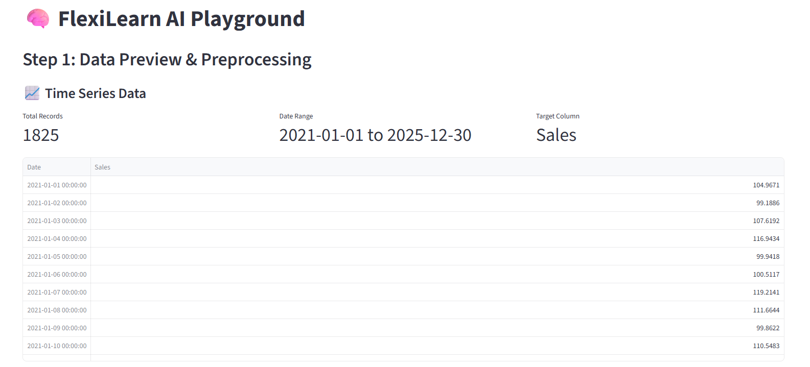
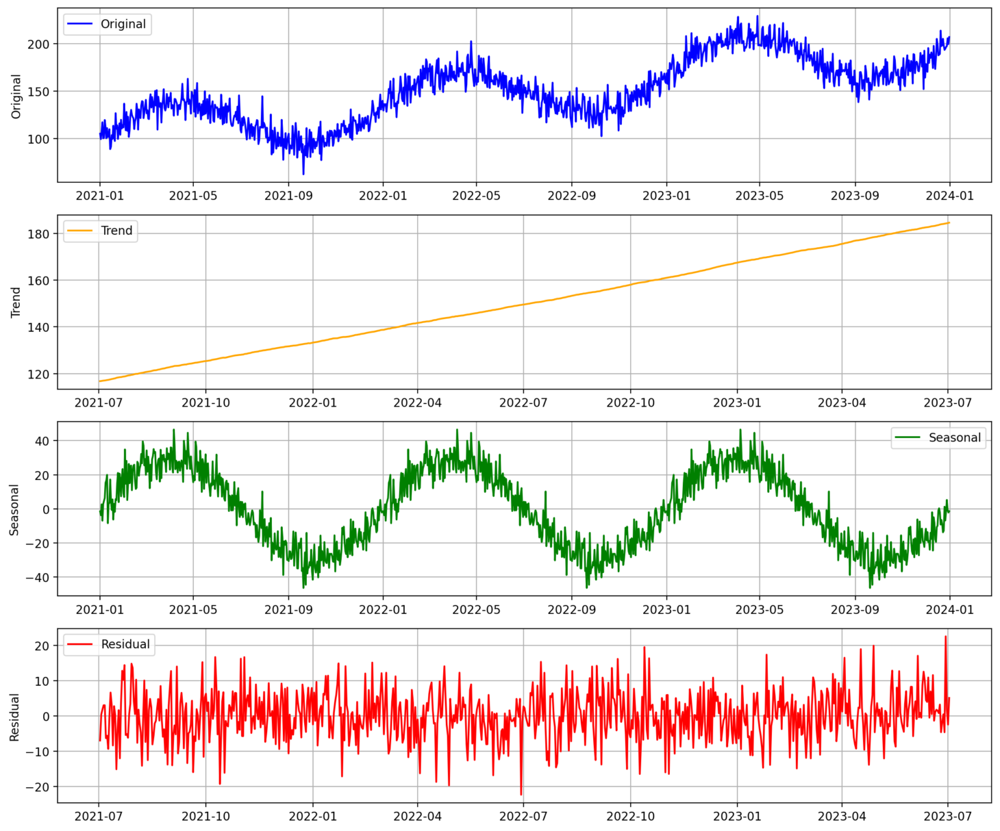
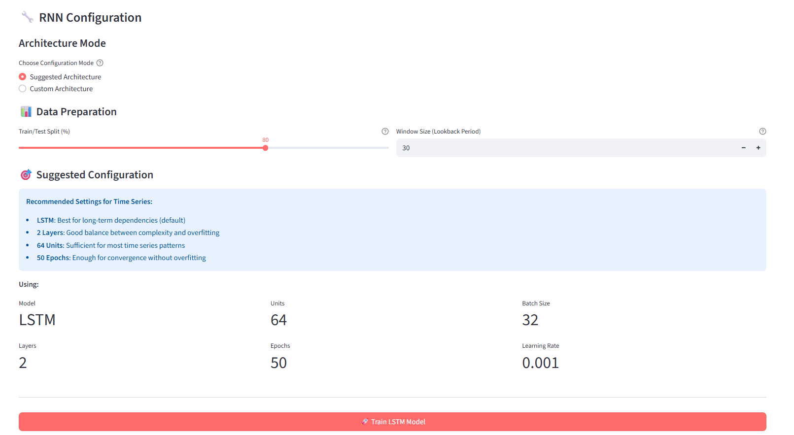

# 🧠 FlexiLearn AI Playground 

**A No-Code Machine Learning & Deep Learning Platform** 

Train and compare ML/DL models through an intuitive web interface—no coding required. Upload your data, choose a model, and get instant results with visualizations.


*The FlexiLearn AI interface: your personal ML/DL laboratory*

---

## 🌟 Key Features

- **Three Data Types**: Tabular (CSV/Excel), Images (ZIP), Time Series
- **Multiple Models**: Classical ML (Scikit-learn), Deep Learning (PyTorch), RNN (Keras)
- **Auto Preprocessing**: One-click data preparation
- **Custom Networks**: Build your own neural architectures or use suggested templates
- **Rich Visualizations**: Confusion matrices, ROC curves, loss curves, forecasts
- **Model Comparison**: Track and compare all your training runs
- **Export Models**: Download trained models for deployment

---

## 🚀 Getting Started

### Prerequisites

- Python 3.8 or higher
- pip package manager

### Installation

1. **Clone or download this repository**

2. **Navigate to the project directory**:
   ```bash
   cd Streamlit_app_deep
   ```

3. **Create a virtual environment** (recommended):
   ```bash
   # Windows
   python -m venv .venv
   .venv\Scripts\activate

   # macOS/Linux
   python3 -m venv .venv
   source .venv/bin/activate
   ```

4. **Install dependencies**:
   ```bash
   pip install -r requirements.txt
   ```

5. **Launch the application**:
   ```bash
   # From the Streamlit_app_deep directory
   python -m streamlit run src/app.py
   ```

6. **Open your browser** to the URL shown in the terminal (typically `http://localhost:8501`)

### Project Structure

```
src/
├── app.py                    # Main application
├── ui/                       # User interface
├── models/                   # Custom datasets
├── evaluation/               # Visualizations
└── utils/                    # Utilities
```


---

## 📚 User Guide

### Step 1: Choose Your Data


*Choose your data source from the sidebar*

**Three Options:**

1. **Upload Files**
   - Tabular: `.csv`, `.xlsx` (max 500MB)
   - Images: `.zip` with folders per class
   - Time Series: `.csv`, `.xlsx` with date column

2. **Classic Datasets**
   - Iris (Classification)
   - California Housing (Regression)


*Built-in datasets for quick testing*

3. **Generate Synthetic Time Series**
   - Auto-generated sales data
   - Includes trend and seasonality
   - Perfect for RNN experiments


*Synthetic data for forecasting practice*

### Step 2: Preprocess Data

**Tabular Data:**


*Select target column and click "Quick Process"*

- Automatic handling of missing values
- Feature scaling and encoding
- 80/20 train-test split


*Data ready for training*

**Image Data:**


*Configure image size and train-test split*

- Resize images (32x32 to 256x256)
- Automatic normalization
- Display sample images

**Time Series:**


*View trends and seasonal patterns*

- Visualize data over time
- Seasonal decomposition (Trend, Seasonality, Residual)
- Understand patterns before forecasting

### Step 3: Train Your Model

**Classical ML (Scikit-learn):**

Choose from Logistic Regression, Random Forest, SVM, KNN, or Decision Trees. Adjust parameters and click **Train**.

**Deep Learning (PyTorch):**

- **Suggested Mode**: Pre-configured architectures for quick starts
- **Custom Mode**: Build your own network layer by layer


*Architecture Guide provides real-time tips for building your network*

**For Tabular Data (ANNs):**


*Build custom neural networks layer by layer*

Add Dense layers with neurons, activation functions (ReLU recommended), and dropout for regularization. Output layer is automatically configured.

**For Image Data (CNNs):**


*Build CNNs with convolutional and pooling layers*

CNNs learn spatial patterns in images. Add Conv2d layers (filters, kernel size) and MaxPool2d layers for downsampling. The network automatically flattens and adds dense layers for classification.

**Training:**


*Configure learning rate, epochs, and batch size*

- **Learning Rate**: How fast the model learns (0.001 recommended)
- **Epochs**: Number of training passes (20-50 typical)
- **Batch Size**: Samples per update (32 recommended)

Click **Train** and monitor the progress. Loss should decrease, accuracy should increase.

**Time Series (RNNs):**

RNNs handle sequential data with memory. Choose from Simple RNN, LSTM (recommended), or GRU.

**Suggested Mode:**


*Pre-configured RNN with optimal settings*

**Custom Mode:** Control window size, layers, units, and training parameters.


*Training progress and forecast results*

### Step 4: Evaluate Results

**Model Comparison Table:**

View all trained models with their metrics (Accuracy, MSE, R², etc.)

**Detailed Analysis:**

**Classification:**
- Confusion Matrix
- Precision, Recall, F1-Score
- ROC Curves with AUC
- Training curves (Deep Learning)


*Monitor training progress*

**Regression:**
- MSE, RMSE, MAE, R² Score
- Predictions vs Actual

**Forecasting (RNN):**
- Loss curves over epochs
- Predictions timeline (train/test)
- Error metrics (RMSE, MAE, R²)

---

### Step 5: Export Models

Download trained models:
- `.pkl` for Classical ML
- `.pth` for PyTorch
- `.keras` for RNN

**Load and Use:**

```python
# Classical ML
import pickle
with open('model.pkl', 'rb') as f:
    model = pickle.load(f)
predictions = model.predict(new_data)

# PyTorch
import torch
model.load_state_dict(torch.load('model.pth'))
predictions = model(new_data_tensor)

# RNN (Keras)
from keras.models import load_model
model = load_model('rnn_model.keras')
predictions = model.predict(scaled_sequences)
```

---

## 🔧 Troubleshooting

**Import errors**: Activate virtual environment, run `pip install -r requirements.txt`

**Upload fails**: Check `.streamlit/config.toml` for 500MB limit

**Slow training**: Reduce batch size, image size, or epochs

**Overfitting**: Add dropout, reduce complexity, get more data

**NaN loss**: Lower learning rate to 0.0001

---

## 👨‍💻 Author 

Built By **BELLMIR Yahya** 

---

**Happy Learning! 🚀**
